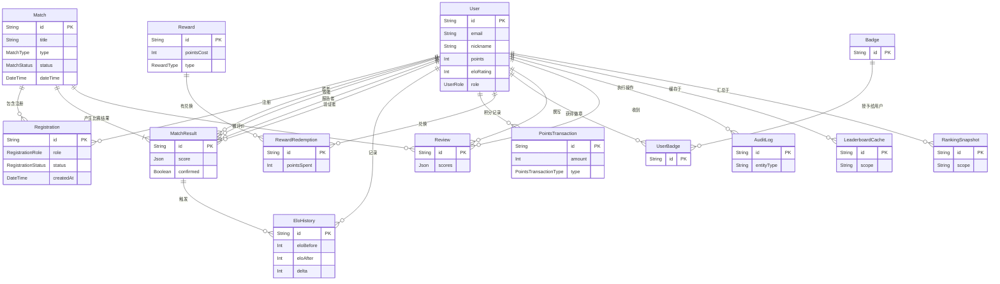

# Database Design

# 数据库设计

## ER 图概览

下面的 ER 图基于 `prisma/schema.prisma` 中定义的实体，展示了实体之间的基数关系和关键联接。像 `UserRole`、`MatchType`、`MatchStatus`、`RegistrationRole`、`RegistrationStatus`、`PointsTransactionType` 和 `RewardType` 这些枚举用于约束相应表的状态。

## 说明

- `Match` / `Registration` / `RegistrationStatus` 三者负责球赛报名流程；表中对 `(matchId, userId)` 的唯一约束用于防止重复报名。
- `MatchResult` 关联到 `Match`，并通过四种不同的 `User` 角色（胜者、败者、报告者、可选的验证者）记录比赛结果，同时由 `EloHistory` 保存 Elo 值变更的时间线。
- 积分流转通过 `PointsTransaction` 记录；`Reward` 与 `RewardRedemption` 记录用户的兑换消费行为。
- 社交与审核数据由 `Review`、`Badge`、`UserBadge` 与 `AuditLog` 支撑，用于保存可审计的交互历史。
- 为了性能，预计算的排行榜使用 `LeaderboardCache`，而历史快照保存在 `RankingSnapshot`（以 `scope` 为键）。

如果你需要，我可以：
- 把 ER 图导出为图片（需要你允许我生成并下载 SVG/PNG），
- 或者把注释更细化成表字段说明文档。
